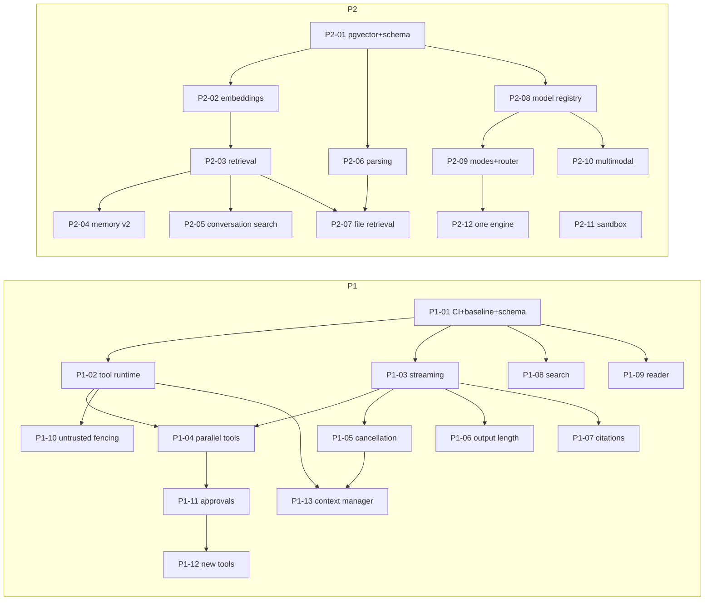

# Sutaeru build program: Phases 1–4

This folder is the build specification for the backend upgrade summarized in `BACKEND_UPGRADE_PLAN.md`.
Coding agents implement it **one work package (WP) at a time**. Claude reviews every pull request against the WP's spec and the rubric below, and decides whether it's approved.

| File | Contents |
|---|---|
| **`HANDOVER.md`** | **Start here if you are a coding agent picking this up fresh:** current state, the exact steps to follow, the order of work, the traps in this codebase |
| `README.md` (this file) | Roles, workflow, rules for agents, the agent prompt template, the review rubric, decisions needed, the dependency map |
| `PHASE-1.md` | Fix the fundamentals: streaming, parallel tools, cancellation, context, search, reader, approvals, new tools |
| `PHASE-2.md` | Memory, files, options: pgvector, hybrid retrieval, memory v2, document parsing, file RAG, model registry, modes, multimodal, sandbox, one engine |
| `PHASE-3.md` | What sets it apart: background runs, plans, deep research v2, realtime voice, per-user connectors, Kemma as MCP server, custom agents, BYOK, media v2, channels |
| `PHASE-4.md` | Quality engine: tracing, cost truth and credits, evals in CI, feedback, safety, logging, reliability |

There are 46 work packages: 13 in Phase 1, 12 in Phase 2, 12 in Phase 3, 9 in Phase 4.

---

## 1. Roles

| Who | Does |
|---|---|
| **Owner (you)** | Answers the decisions in §6, provides API keys, runs container rebuilds and restarts and DB image changes (agents never do that, per `PLAN.md`), merges `develop` → `main` at each phase gate. |
| **Coding agents** | Implement exactly one WP per branch and PR, with tests and evidence. |
| **Claude (reviewer)** | Reviews every PR against its WP section and the rubric in §5, runs the checks, posts a verdict (APPROVE / CHANGES REQUESTED / REJECT), and runs the phase gate review in §7. |

## 2. Branching and flow

`main` auto-deploys to the VPS on every push (`.github/workflows/deploy.yml`), so WPs never target `main` directly.

```
main ── (phase gate merge, deploys) ───────────────────────────────▶
  └─ develop ── PR ◀─ wp/P1-01-ci-baseline
               ── PR ◀─ wp/P1-02-tool-runtime
               ── PR ◀─ …
```

1. The owner creates `develop` from `main` once.
2. Each WP gets a branch `wp/<WP-ID>-<slug>` from the latest `develop`, and a PR into `develop`. The title is `[<WP-ID>] <title>`.
3. Claude reviews. CHANGES REQUESTED means the agent fixes on the same branch; there are no new PRs per round.
4. When every WP of a phase is merged and the phase gate passes (§7), the owner merges `develop` → `main`.
5. Risky behavior ships **behind a feature flag that's off by default** (see each WP), so a phase can deploy dark and be switched on deliberately.

## 3. Rules every coding agent must follow

**Scope**
- Implement only your WP. If you need something from another WP that isn't merged, stop and say so in the PR. Don't build it yourself.
- Touch only the files your WP lists, plus tests and docs. Any other file needs a one-line reason in the PR body.
- No drive-by refactors, renames, formatting sweeps or dependency major-version upgrades.

**Codebase conventions** (match the surrounding code)
- TypeScript ESM, `tsx` for scripts, Vitest tests next to the source (`foo.test.ts`). Use `vi.mock` of module boundaries, as in `server/kemma/engine.audit.test.ts`.
- **Read env vars at call time, never at import time.** Secret Manager fills `process.env` after imports (see `server/_core/env.ts`). A module-level `const KEY = process.env.X` is a bug.
- Every new env var goes in `ENVIRONMENT_VARIABLES.md` and `.env.example` (blank value, with a comment).
- Errors shown to users are plain and safe. Provider response bodies, keys and file contents never go into a response or a log line.
- Every model, search, fetch or sandbox call that costs money writes a `usage_logs` row (`server/core/usage.ts`).
- Feature flags live in one registry, `server/core/flags.ts` (created in P1-01), and are read as `FF_<NAME>` env vars. A WP that introduces a flag adds it there, with its default and a one-line description.
- Model ids, provider URLs and prices are configuration (the env plus the P2-08 registry), never literals scattered through the code.

**Database**
- Migrations are additive and idempotent (`IF NOT EXISTS`, no drops or renames in the same phase). Each WP that changes the schema updates `drizzle/schema.ts` and adds a journaled file under `drizzle/migrations/` (follow `0024_usage_cached_tokens.sql` and `meta/_journal.json`).
- Each phase's first WP owns that phase's schema. Later WPs in the phase don't add migrations unless their spec says so. This avoids numbering conflicts between parallel agents.

**Safety** (from `PLAN.md`; these can't be traded away)
- **G1** The agent can never delete, trash, share or change permissions on any file. No tool may offer that.
- **G2** Drive access is confined to the Sutaeru root folder.
- **G3/G4** Edits to existing documents need user confirmation. Creates, saves and moves are logged in `audit_logs`.
- New in this program: every tool has a risk class (`read | write | destructive`). `write` tools that act outside Sutaeru (send email, create calendar events, MCP confirm-mode tools) need user approval (P1-11). `destructive` tools aren't offered to the model at all.
- Never print, log or modify `.env` or secrets. Never rebuild or restart containers. If a WP needs a recreate (DB image, new sidecar), write the exact command in the PR under "Owner actions".

**Compatibility**
- The existing SSE events (`token`, `agent`, `model`, `tool_start`, `tool_end`, `activity`, `skill`, `quota_warn`, `notice`, `sources`, `usage`, `done`, `error`) keep their names and payload shapes. You may add fields and new event types. The current `client/src/pages/Chat.tsx` ignores unknown events.
- Existing HTTP and tRPC contracts keep working unless the WP says to retire them.

**Quality bar**
- `npm run check` and `npm test` pass. No new failures compared with the baseline recorded in P1-01.
- New behavior has tests, including failure paths (provider down, timeout, abort, bad input).
- Performance claims come with numbers from `scripts/bench-chat.ts` (P1-01).

## 4. Prompt template to give each coding agent

```
You are implementing work package <WP-ID> in the Sutaeru repository.

Read first, fully:
  1. docs/spec/README.md            (rules, conventions, review rubric)
  2. docs/spec/PHASE-<n>.md, section <WP-ID>  (your spec)
  3. Every file listed under "Files" in your WP.

Branch: wp/<WP-ID>-<slug> from origin/develop. Open a PR into develop titled "[<WP-ID>] <title>".

Do:
  - Implement exactly the spec. Where the spec says "verify against current docs", check the
    provider's current API docs and note the version you used in the PR.
  - Write the tests named in "Tests" plus any others the change needs.
  - Run: npm run check && npm test (and the bench, if the WP has performance criteria).
  - Fill in the PR body using the template in README.md §5.3.

Don't:
  - Touch files outside the WP without a written reason.
  - Change .env, secrets or deploy.yml, or restart containers.
  - Turn on a feature flag by default unless the WP says so.

If the spec is wrong or impossible as written, stop and explain in the PR rather than improvising.
```

## 5. Review rubric (how Claude judges)

### 5.1 Gate checks (all must pass, or the verdict is CHANGES REQUESTED)

| # | Gate | How it's checked |
|---|---|---|
| R1 | CI green: typecheck and tests | CI run on the PR head (from P1-01); re-run locally when in doubt |
| R2 | Scope matches the WP | Diff file list vs. the WP's "Files" list; unexplained extras get flagged |
| R3 | Every acceptance criterion has evidence | PR body checklist with output, numbers or test names |
| R4 | Tests cover new behavior and failure paths | Read the tests; mutation spot-check (does a test fail if the key line is removed?) |
| R5 | No secret, key or content leakage | Grep the diff for logging of request bodies, keys, tokens or file text |
| R6 | Migrations are additive and idempotent; schema.ts and journal updated | Read the SQL; apply twice on a scratch DB when the WP adds schema |
| R7 | Flags default as specified | Read the flag registry diff |
| R8 | Backward compatible | Old SSE events intact; existing endpoint tests still pass |
| R9 | Safety rules G1–G4 and the approval rule | Any new tool: risk class set; write tools gated; no delete/share capability |
| R10 | Env vars read at call time and documented | Grep for module-level `process.env` reads; check both docs files |

### 5.2 Quality score (1–5 each; approval needs an average of at least 3.5 and no score of 1)

Correctness · simplicity and fit with surrounding code · performance · observability (usage rows, logs, events) · test quality.

**Verdicts:** **APPROVE** · **CHANGES REQUESTED** (numbered must-fix list, then optional nits) · **REJECT** (the approach is wrong; the WP gets re-scoped before anyone continues).

### 5.3 PR body template (agents fill this in)

```
## <WP-ID> <title>
Summary: <2–4 sentences>

### Acceptance criteria
- [x] AC1 … → evidence: <test name / command output / numbers>
- [x] AC2 …

### Commands run
npm run check → <result>
npm test → <N passed, M failed (baseline M)>
bench (if required) → <table before/after>

### Schema / flags / env
Migrations: <files or "none"> · Flags: <name=default> · Env vars: <names, documented in both files>

### Owner actions
<exact commands the owner must run, e.g. container recreate, or "none">

### Deviations from spec
<none, or what changed and why>
```

## 6. Decisions needed from the owner (recommended defaults in bold)

Agents can start Phase 1 with the defaults. Each answer changes only configuration, not code structure.

| # | Decision | Options | Blocks |
|---|---|---|---|
| D1 | Integration branch | **create `develop`, deploy at phase gates** / merge each WP to main | all |
| D2 | Primary search API | **Brave Search** + **Tavily** as second / Exa / Perplexity Search API / self-hosted SearXNG only | P1-08 |
| D3 | Reader fallback for JS-heavy pages | **Jina Reader** / Firecrawl (API or self-hosted) | P1-09 |
| D4 | Where production Postgres runs | compose `postgres` on the VPS (needs the pgvector image, **built on alpine, P2-01**) / managed (Cloud SQL, Neon or Supabase all have pgvector) | P2 |
| D5 | Let users pick models | **yes, gated by tier, behind `USER_MODEL_PICKER`** / no, keep router-only | P2-07 |
| D6 | Access to Claude / GPT models | **through the existing LiteLLM gateway** (`litellm/…` ids) / direct provider keys | P2-07 |
| D7 | Embedding model | **keep Gemini** (stored at 1024 dimensions) / Voyage-3 / self-hosted Qwen3-Embedding or BGE-M3 | P2-02 |
| D8 | Realtime voice stack | **Node WebSocket pipeline: Deepgram STT + ElevenLabs streaming TTS** / LiveKit Agents | P3-04 |
| D9 | Tracing backend | **Langfuse (self-hosted in compose)** / Langfuse Cloud / any OTLP backend | P4-01 |
| D10 | Monthly budget for automated eval runs | e.g. **$50** | P4-03 |

## 7. Phase gates

A phase is done when every WP is approved and merged into `develop` and Claude's gate review passes the phase's exit criteria (listed at the end of each `PHASE-n.md`), measured on `develop` with the bench and evals. Claude writes the gate report as a PR comment on the `develop` → `main` PR, and the owner merges.

## 8. Dependency map and parallel lanes



- **Phase 1** lanes after P1-01: **A** engine (P1-02 → P1-03 → P1-04 → P1-05/06/07 → P1-13), **B** search (P1-08), **C** reader (P1-09), **D** safety and actions (P1-10 → P1-11 → P1-12). A, B and C run in parallel; D starts once P1-02 and P1-04 are merged.
- **Phase 2** lanes after P2-01: **A** memory (P2-02 → P2-03 → P2-04/05), **B** files and sandbox (P2-06 → P2-07, P2-11), **C** models (P2-08 → P2-09/10 → P2-12).
- **Phase 3:** P3-01 (durable runs, which also owns Phase 3's schema) gates everything. Then **A** runs and research (P3-02, P3-03, P3-04), **B** voice (P3-05 → P3-06), **C** connectivity (P3-07 → P3-08, P3-12), **D** personalization (P3-09, P3-10, P3-11).
- **Phase 4:** P4-01 gates. Then **A** quality (P4-02 → P4-05/06), **B** money (P4-03 → P4-04), **C** robustness (P4-07, P4-08, P4-09). P4-01 and P4-02 may start during Phase 3.

| Phase | WPs | Agent-days (est.) | Calendar (est., parallel lanes) |
|---|---|---|---|
| 1 | 13 | ~25 | ~2 weeks |
| 2 | 12 | ~30 | ~2.5 weeks |
| 3 | 12 | ~45 | ~3–4 weeks |
| 4 | 9 | ~22 | ~2 weeks, then ongoing |

Size: **S** ≈ 1 agent-day, **M** ≈ 2–3 days, **L** ≈ 4–6 days, each including review rounds.
